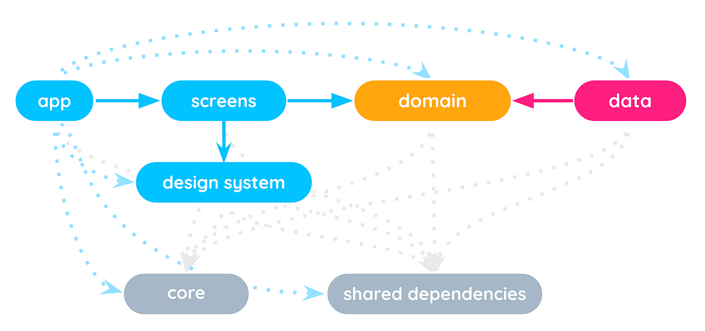

# Flutter Clean Architecture

An opiniated implementation of Clean Architecture in Flutter, where each layer
is a separated package.

## Architecture

The architecture is based on the following diagram:

👀 For more information about this implementation, please read the following Medium articles series:

📝 [Multi-packages Clean Architecture in Flutter](https://medium.com/steeple-product/multi-packages-clean-architecture-in-flutter-series-d71b2a61b962) 📝 

Note: this repository is based on [an old repo of mine](https://github.com/orevial/flutter-tips-and-tricks)
but was adapated with Clean Architecture in mind but the initial project was not using 
it so the adaptation might not be perfect, please be indulgent 😉